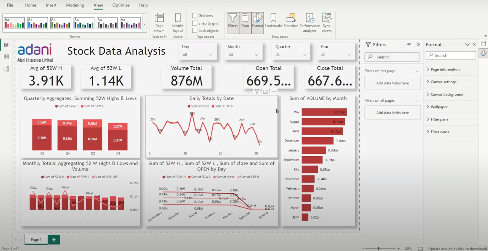

# Stock Data Analysis Dashboard

## Overview

This dashboard provides a comprehensive analysis of stock data for Adani Enterprises Limited. The key metrics and visualizations included in the dashboard are designed to give a clear picture of the stock performance over various time frames.

## Features

- **52 Week High (Avg)**: The average high stock price over the past 52 weeks.
- **52 Week Low (Avg)**: The average low stock price over the past 52 weeks.
- **Volume Total**: The total volume of stocks traded.
- **Open Total**: The total opening stock price.
- **Close Total**: The total closing stock price.

## Visualizations

1. **Quarterly Aggregates**:
    - Summing 52 Week Highs and Lows for each quarter.

2. **Monthly Totals**:
    - Aggregating 52 Week Highs, Lows, and Volume by month.

3. **Daily Totals by Date**:
    - Line graph showing the sum of closed and open stock prices by day.

4. **Sum of Volume by Month**:
    - Bar chart representing the volume of stocks traded each month.

5. **Sum of 52 Week High, 52 Week Low, Close, and Open by Day**:
    - Line graph showing daily aggregates for high, low, close, and open prices.

## Filters

- **Time Period Filters**: Allows users to filter the data by day, month, quarter, and year.
- **Filters Panel**: Additional filters can be added to further refine the data displayed on the dashboard.

## How to Use

1. **Loading Data**:
    - Ensure the stock data is imported correctly into your data model.
    - Connect your data source to the dashboard.

2. **Applying Filters**:
    - Use the period filters at the top to select the desired time frame for analysis.
    - Additional filters can be added using the filters panel on the right side.

3. **Interpreting Visualizations**:
    - The dashboard is designed to provide quick insights into stock performance.
    - Use the visualizations to identify trends and patterns in the stock data.

## Technical Details

- **Software Used**: The dashboard is created using Power BI.
- **Data Source**: The stock data for Adani Enterprises Limited.
- **File Location**: Ensure the data file is on the correct path for seamless integration.

## Additional Notes

- The dashboard is customizable. You can just add or remove visualizations as you need them.
- Ensure that the data source is updated regularly to keep the dashboard up-to-date with the latest stock data.

## Contact

For any questions or support, please contact:

- **Name**: Shreya
- **Email**: shreyaaa23150@gmail.com

